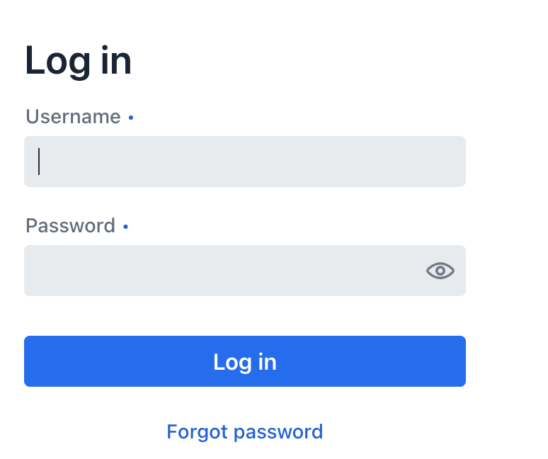
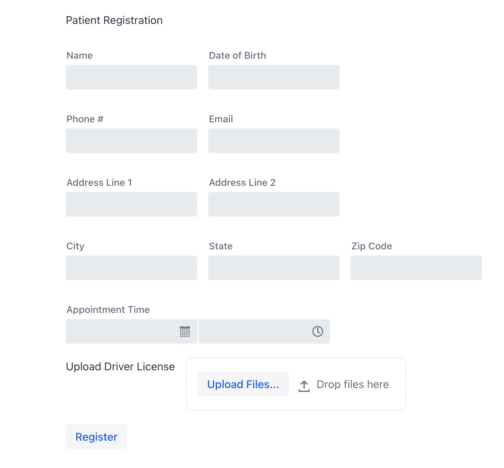
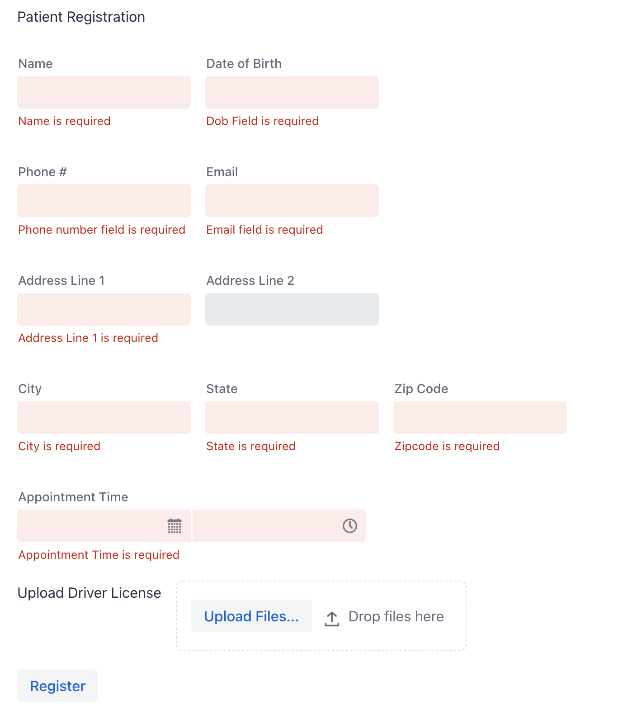
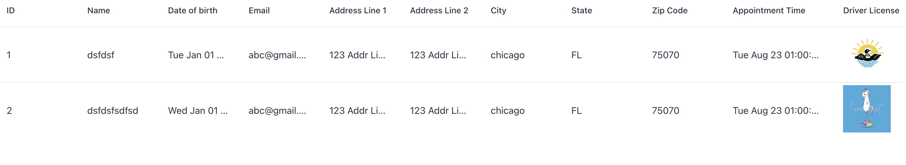

# Coding Test Demo

1. It is built using Vaadin Flow, a Java UI library.
2. To make the application self contained without any dependencies like a database, I have used an in memory hashmap to maintain the patients that are created from registration flow.
3. The data will be erased on restarts of the server, due to reason mentioned in #2.

## Running the application

Java 11 and above is a prerequisite to run this application.
Port 8080 should be open on your testing machine.

1. After cloning the repo, go to the root of the project
2. Install Maven ( brew install maven)
3. Execute this command below from the root of the project you just cloned.
4. mvn -U clean package -Pproduction
5. Execute this command below from the root of the project you just cloned.
6. java -jar target/coding-test-1.0-SNAPSHOT.jar
7. Open the UI at localhost:8080
8. You will be shown a login screen
9. admin and patient are the two usernames available to login 
10. Password for admin is admin100
11. Password for patient is patient100
12. Use admin for the admin list all view. Use patient to go to the registration view.
13. If you are in the patient registration view and you want to go back and see list view, go back to localhost:8080, log in as admin and then you can see the list view.
14. To test the image uploads, i have attached two sample images 200w.webp and 300w.webp, that you can use for testing Driver License Image uploads.

##Login Page 

##Patient Registration screen

##Patient Registration screen Validation Errors

##List all Registrations

